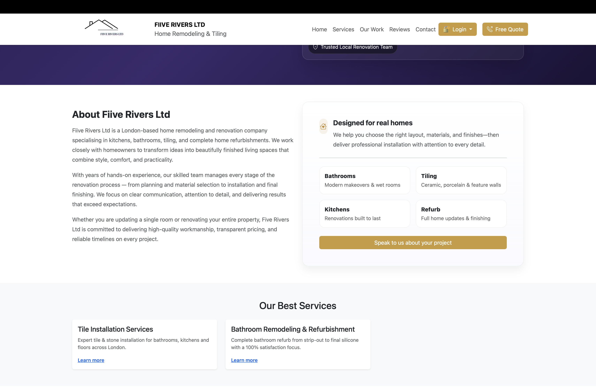
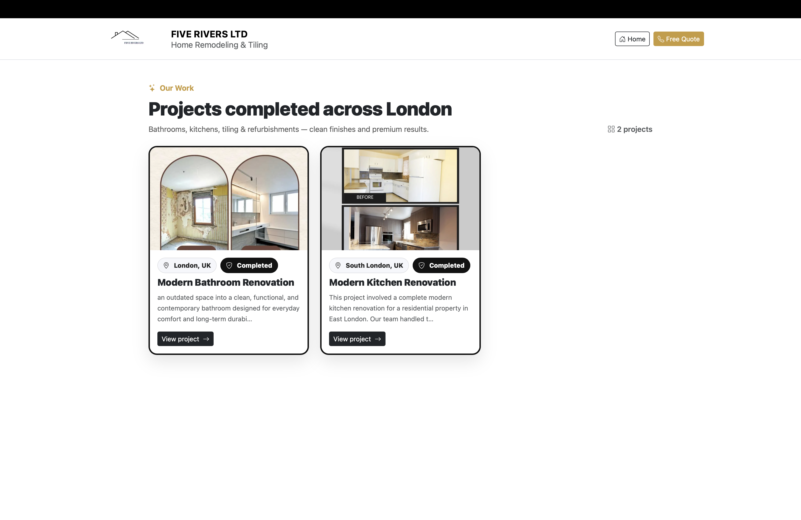
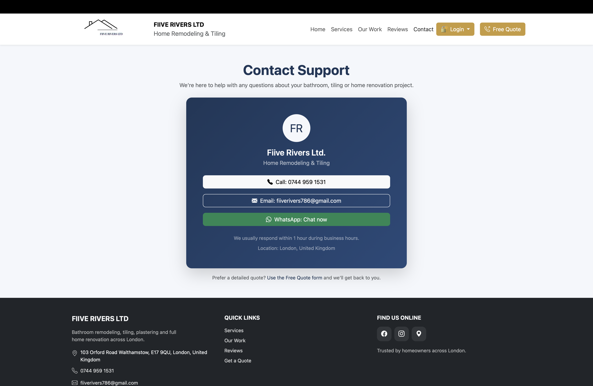
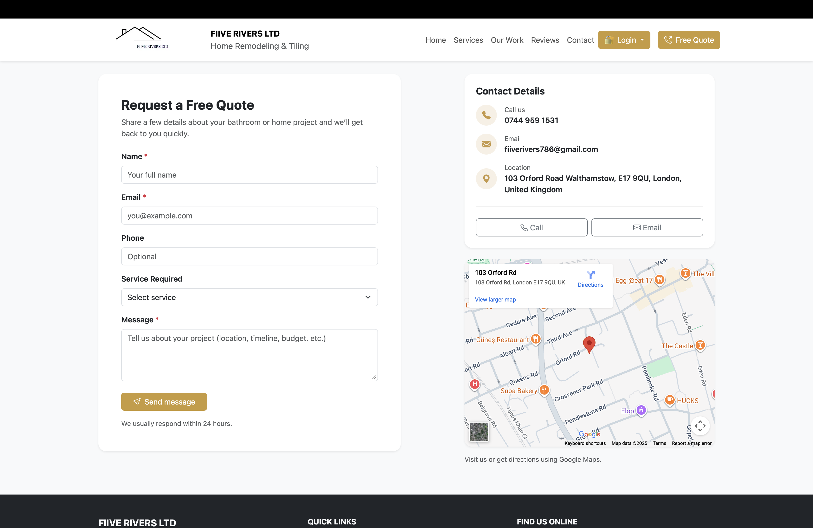

# Five Rivers Ltd — Home Remodeling & Tiling (Laravel)

**Live Website:** https://www.fiiveriversltd.co.uk/contact
**GitHub Repo:** https://github.com/rajan999135/roofing-website

A production-ready Laravel website built for a UK-based client to help grow a small renovation business online. The platform includes a modern marketing site, project gallery, customer reviews, and an admin panel for managing content.


---

## Screenshots

### Home Page




### Services


### Projects



### Login and authentication


### Contact & Quote




---

## Features

### Public Pages (Customer)
- **Home page** with hero section + CTA buttons (Request Quote / View Work)
- **Services page** (bathrooms, kitchens, tiling, plastering, refurbishments)
- **Projects gallery** (kitchen/bathroom renovations, before/after)
- **Single project page** with full images + details
- **Customer reviews page** (view all reviews)
- **Contact page** with quick contact + quote form

### Authentication
- **Signup / Login**
- **Password reset**
- **Login with Google (OAuth)**

### Admin Panel (Content Management)
- Upload **new projects**
- Upload **project images**
- Manage **project cover image**
- Review moderation (optional)
- Basic access control (admin-only routes)

### Reviews
- Logged-in users can submit reviews (rating + comment)
- Visitors can read all reviews
- Admin can remove/approve reviews (depending on configuration)

---

## Tech Stack
- **Laravel (PHP)**
- Blade + Bootstrap/Tailwind UI
- MySQL database
- File uploads (projects & gallery)
- Google OAuth (Socialite)

---

## Local Setup (Developer)

### Requirements
- PHP 8.1+ (recommended)
- Composer
- Node.js + npm (for Vite assets)
- MySQL

### Installation
```bash
git clone git@github.com:rajan999135/roofing-website.git
cd roofing-website
composer install
cp .env.example .env
php artisan key:generate
php artisan migrate
php artisan storage:link
npm install
npm run dev
php artisan serve
